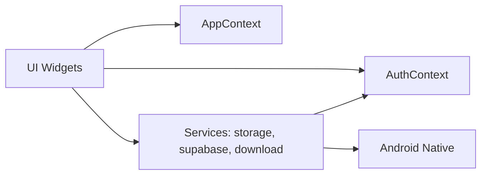

# Architecture

High-level overview

This is a Flutter application (calmreader_mobile) that provides reading, download, and playback features. The frontend is implemented in React-style Flutter widgets and organized under `lib/src`.

Folder structure (high level)

- `lib/` — Flutter app entrypoint (`main.dart`)
- `lib/src/` — application code (components, services, pages)
- `android/` — native Android wrapper and build files

State management

- The app uses React-style context providers (`context/AppContext.tsx`, `AuthContext.tsx`) to propagate app state. (Note: The project codebase appears to be a mixed-codebase with a TypeScript/Vite web app; the mobile app in `calmreader_mobile` is Flutter.)

Navigation flow

- Typical Flutter navigation with named routes handled by `MaterialApp` in `main.dart`.

Authentication flow

- Supabase (see `lib/src/services/supabaseAuth.dart` if present) manages authentication flows: sign-in, sign-up, token storage, and refresh.

Storage and offline

- Downloads are stored under app internal storage using the `storageService` and `download` pipeline.
- Offline reader reads files directly from local storage and manages indexing in a lightweight DB (sqflite or hive typically).

Database and API flows

- Supabase Postgres + Storage are used for user data and media storage. App communicates via Supabase REST/gotrue and Storage APIs.

Security flow

- Authentication tokens stored securely (prefer using Android keystore + secure storage plugin).

Error handling

- Services generally return Result/Exception objects; UI surfaces errors in dialogs and telemetry (DeveloperDiagnostics).

Component interaction (Mermaid)

